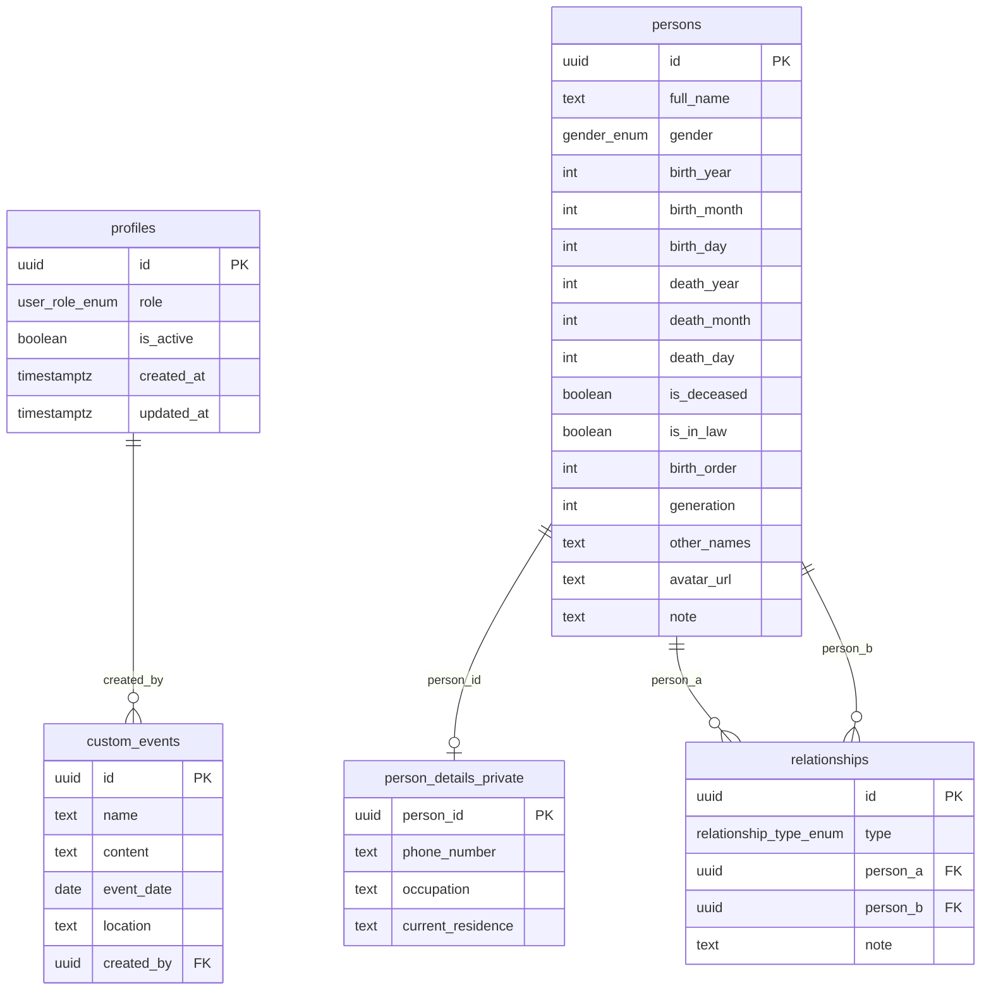
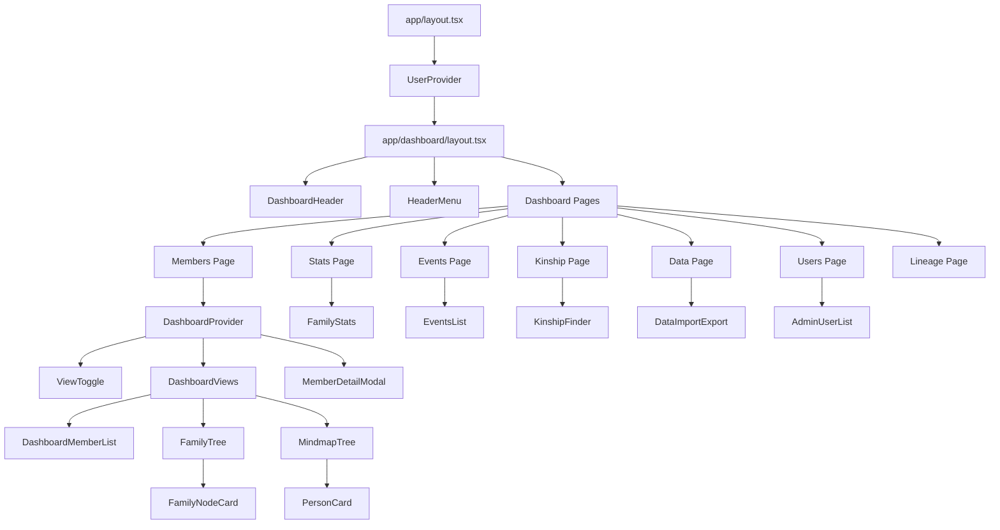
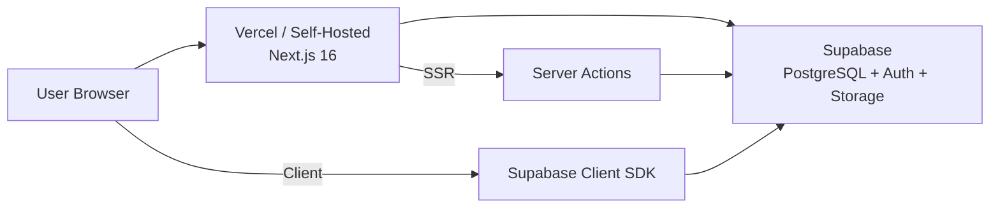

# Product Requirements Document (PRD)
# Gia Phả OS — Vietnamese Family Genealogy Platform

**Version:** 0.1.0  
**Date:** 2026-03-09  
**Repository:** [giapha-os](file:///c:/Users/Admin/Desktop/Project/mine/giapha-os)  
**License:** MIT  
**Demo:** [giapha-os.homielab.com](https://giapha-os.homielab.com)

---

## 1. Product Overview

**Gia Phả OS** is an open-source, self-hosted web application for managing Vietnamese family genealogy (gia phả). It provides an intuitive, visual interface for viewing family trees, managing family members, finding kinship terms, and tracking important family events.

### 1.1 Problem Statement

Vietnamese families need a way to collaboratively maintain their family genealogy (gia phả) across geographical distances. Existing solutions either:
- Rely on local, single-machine storage (Excel, Word files) that can't be shared
- Use third-party services that don't respect data privacy for sensitive family information
- Lack Vietnamese-specific features like **kinship terminology** (danh xưng) and **lunar calendar** support for death anniversaries (ngày giỗ)

### 1.2 Solution

A cloud-based, self-hosted genealogy platform that:
- Allows multiple family members to collaboratively update records from anywhere
- Keeps all data under the family's control via their own Supabase instance
- Provides Vietnamese-specific features not found in Western genealogy software
- Is free and open-source

### 1.3 Target Users

| User Type | Description |
|-----------|-------------|
| **Family Elder / Admin** | Maintains and controls the family genealogy. Manages user accounts. |
| **Editor** | Family members trusted to add/edit/delete records. |
| **Member** | General family members who can browse the genealogy read-only. |

---

## 2. Technology Stack

| Layer | Technology | Version |
|-------|-----------|---------|
| **Framework** | Next.js (App Router) | 16.1.6 |
| **UI Library** | React | 19.2.4 |
| **Styling** | Tailwind CSS | 4.2.1 |
| **Animation** | Framer Motion | 12.34.3 |
| **Database / Auth / Storage** | Supabase (PostgreSQL + Auth + Storage) | supabase-js 2.98.0 |
| **Icons** | Lucide React | 0.575.0 |
| **Lunar Calendar** | lunar-javascript | 1.7.7 |
| **Data Export** | jsPDF, html-to-image, JSZip, PapaParse | — |
| **Language** | TypeScript | 5.9.3 |
| **Package Manager** | Bun (primary), npm (fallback) | — |
| **Deployment** | Vercel (recommended), self-hosted | — |

---

## 3. Information Architecture

### 3.1 Page Routing Structure

```
/                           → Landing page (LandingHero)
/login                      → Authentication (email/password)
/about                      → About page
/setup                      → Initial database setup guide
/missing-db-config          → Database configuration error page
/dashboard                  → Dashboard home (overview)
/dashboard/members          → Member list + Tree + Mindmap views
/dashboard/members/new      → Create new member form
/dashboard/members/[id]     → Member detail view
/dashboard/members/[id]/edit → Edit member form
/dashboard/stats            → Family statistics & demographics
/dashboard/events           → Upcoming events (birthdays, giỗ, custom)
/dashboard/kinship          → Kinship term finder
/dashboard/lineage          → Lineage management
/dashboard/data             → Data import/export center
/dashboard/users            → Admin user management
```

### 3.2 Database Schema (Supabase PostgreSQL)



**Enums:**
- `gender_enum`: `male`, `female`, `other`
- `relationship_type_enum`: `marriage`, `biological_child`, `adopted_child`
- `user_role_enum`: [admin](file:///c:/Users/Admin/Desktop/Project/mine/giapha-os/app/actions/user.ts#38-71), `editor`, `member`

**Key constraints:**
- `no_self_relationship`: Prevents a person from having a relationship with themselves
- `UNIQUE(person_a, person_b, type)`: Prevents duplicate relationships

---

## 4. Core Features

### 4.1 Family Tree Visualization

| Feature | Description |
|---------|-------------|
| **Tree View** | Hierarchical top-down tree diagram showing parent-child relationships |
| **Mindmap View** | Radial/mindmap layout for exploring family connections |
| **List View** | Tabular list of all members with filtering |
| **Root Selector** | Choose which ancestor to display as the tree root |
| **Tree Filters** | Show/hide spouses, filter by gender |
| **Modal Detail** | Click any person node to view their full profile in a modal |

**Components:** `FamilyTree.tsx`, `MindmapTree.tsx`, `DashboardMemberList.tsx`, `FamilyNodeCard.tsx`, `PersonCard.tsx`, `ViewToggle.tsx`, `RootSelector.tsx`, `DashboardViews.tsx`

### 4.2 Member Management (CRUD)

| Feature | Description |
|---------|-------------|
| **Create Member** | Form with: name, gender, birth/death dates, avatar upload, notes, private details |
| **Edit Member** | Full edit form with all fields |
| **Delete Member** | Requires all relationships to be removed first (integrity check) |
| **Avatar Upload** | Images stored in Supabase Storage (`avatars` bucket), publicly accessible |
| **Private Details** | Phone, occupation, residence — restricted to Admin/Editor via RLS |
| **Birth Order** | Explicit ordering among siblings |
| **Generation** | Generational depth tracking |
| **In-Law Flag** | Distinguish between blood relatives and in-laws |
| **Other Names** | Alternative names, aliases |

**Components:** `MemberForm.tsx`, `MemberDetailContent.tsx`, `MemberDetailModal.tsx`, `DeleteMemberButton.tsx`, `AvatarToggle.tsx`, `DefaultAvatar.tsx`

### 4.3 Relationship Management

| Feature | Description |
|---------|-------------|
| **Marriage** | Bidirectional spouse links (supports polygamy) |
| **Biological Child** | Parent → child links |
| **Adopted Child** | Parent → adopted child links |
| **Relationship Notes** | Optional notes on each relationship |
| **PersonSelector** | Dropdown with search for selecting family members |

**Components:** `RelationshipManager.tsx`, `PersonSelector.tsx`

### 4.4 Kinship Term Finder (Danh Xưng)

A core Vietnamese-specific feature that automatically determines the correct Vietnamese kinship term between any two people in the family tree.

| Feature | Description |
|---------|-------------|
| **BFS/LCA Algorithm** | Finds the Lowest Common Ancestor between two people |
| **Vietnamese Terms** | Correctly outputs terms: Bác, Chú, Cô, Dì, Anh, Chị, Em, Cháu, etc. |
| **Seniority Comparison** | Uses `birth_order` and `birth_year` to determine senior/junior status |
| **Ancestor/Descendant Depth** | Supports up to 10 generations of ancestors (Sơ, Kỵ, Cụ, Ông/Bà...) and 8 levels of descendants (Con, Cháu, Chắt, Chít...) |
| **In-Law Handling** | Correctly handles spouse-mediated relationships |
| **Path Description** | Shows the relationship path between the two people |

**Core Logic:** [kinshipHelpers.ts](file:///c:/Users/Admin/Desktop/Project/mine/giapha-os/utils/kinshipHelpers.ts) (672 lines)  
**Component:** `KinshipFinder.tsx`

### 4.5 Events & Calendar

| Feature | Description |
|---------|-------------|
| **Birthdays (Solar)** | Tracks upcoming birthdays based on solar calendar |
| **Death Anniversaries (Lunar)** | Converts death dates to lunar calendar for ngày giỗ tracking |
| **Custom Events** | User-created events with name, date, location, content |
| **Upcoming Sort** | Events sorted by days until next occurrence |

**Core Logic:** [eventHelpers.ts](file:///c:/Users/Admin/Desktop/Project/mine/giapha-os/utils/eventHelpers.ts) (uses `lunar-javascript` for Solar ↔ Lunar conversion)  
**Components:** `EventsList.tsx`, `CustomEventModal.tsx`

### 4.6 Family Statistics

| Feature | Description |
|---------|-------------|
| **Demographics** | Total members, gender distribution, living/deceased counts |
| **Generational Stats** | Members per generation |
| **Visual Dashboard** | Statistical charts and summary cards |

**Component:** `FamilyStats.tsx`

### 4.7 Data Import / Export

| Format | Import | Export | Details |
|--------|--------|--------|---------|
| **JSON** | ✅ | ✅ | Full backup with version field (`v2`), supports subtree export via `rootId` |
| **CSV (ZIP)** | ✅ | ✅ | `persons.csv` + `relationships.csv` in a ZIP archive |
| **GEDCOM** | ✅ | ✅ | Standard genealogy interchange format (5.5.1 compatible) |
| **PDF** | ❌ | ✅ | Tree image export via `html-to-image` + `jsPDF` |

**Components:** `DataImportExport.tsx`, `ExportButton.tsx`  
**Utilities:** [data.ts](file:///c:/Users/Admin/Desktop/Project/mine/giapha-os/app/actions/data.ts), [csv.ts](file:///c:/Users/Admin/Desktop/Project/mine/giapha-os/utils/csv.ts), [gedcom.ts](file:///c:/Users/Admin/Desktop/Project/mine/giapha-os/utils/gedcom.ts)

> [!IMPORTANT]
> JSON import is a **destructive** operation — it deletes all existing persons and relationships before inserting imported data. Data is chunked in batches of 200 for large families.

### 4.8 Lineage Management

| Feature | Description |
|---------|-------------|
| **Lineage View** | Dedicated view for managing direct lineage paths |
| **Branch Management** | Organize and view specific family branches |

**Component:** `LineageManager.tsx`

---

## 5. Authentication & Authorization

### 5.1 Authentication (Supabase Auth)

| Feature | Description |
|---------|-------------|
| **Email/Password** | Standard email + password authentication |
| **First User Auto-Admin** | First registered user is automatically promoted to [admin](file:///c:/Users/Admin/Desktop/Project/mine/giapha-os/app/actions/user.ts#38-71) with email auto-confirmed |
| **Subsequent Users** | Default to `member` role |
| **Session Management** | Handled via `@supabase/ssr` with server-side cookie-based sessions |
| **Middleware** | Supabase middleware refreshes sessions on each request |

### 5.2 Authorization (Role-Based Access Control)

| Role | View Tree | Edit Members | Delete Members | Manage Users | Import/Export |
|------|-----------|-------------|---------------|-------------|--------------|
| **Admin** | ✅ | ✅ | ✅ | ✅ | ✅ |
| **Editor** | ✅ | ✅ | ✅ | ❌ | ❌ |
| **Member** | ✅ | ❌ | ❌ | ❌ | ❌ |

**Enforcement layers:**
1. **Database (RLS):** PostgreSQL Row-Level Security policies on all tables
2. **Server Actions:** Role checks in [member.ts](file:///c:/Users/Admin/Desktop/Project/mine/giapha-os/app/actions/member.ts), [data.ts](file:///c:/Users/Admin/Desktop/Project/mine/giapha-os/app/actions/data.ts), [user.ts](file:///c:/Users/Admin/Desktop/Project/mine/giapha-os/app/actions/user.ts)
3. **UI:** Conditional rendering based on `UserProvider` context

### 5.3 Admin User Management

| Feature | Description |
|---------|-------------|
| **View All Users** | List all registered users with email, role, active status |
| **Change Roles** | Promote/demote users between admin/editor/member |
| **Create Users** | Admin can directly create new users (bypasses email confirmation) |
| **Delete Users** | Remove user accounts (cannot delete self) |
| **Activate/Deactivate** | Toggle user active status (approve/block) |

**Server Actions:** [user.ts](file:///c:/Users/Admin/Desktop/Project/mine/giapha-os/app/actions/user.ts) (calls Supabase RPC functions: `get_admin_users`, `set_user_role`, `delete_user`, `admin_create_user`, `set_user_active_status`)  
**Component:** `AdminUserList.tsx`

---

## 6. Security & Privacy

| Principle | Implementation |
|-----------|---------------|
| **Self-Hosted** | All data stored in the user's own Supabase instance |
| **No Telemetry** | Zero analytics, tracking, or data collection in source code |
| **RLS** | All tables protected with Row-Level Security |
| **Private Data Separation** | Sensitive fields (phone, occupation, residence) in separate `person_details_private` table with stricter RLS |
| **SECURITY DEFINER Functions** | Admin RPC functions execute with elevated privileges but include admin checks |
| **Avatars** | Stored in public Supabase Storage bucket; upload restricted to authenticated users |

---

## 7. Non-Functional Requirements

| Requirement | Target |
|-------------|--------|
| **Responsiveness** | Mobile-first, optimized for both desktop and mobile |
| **Performance** | Family trees up to ~10,000 members fit in memory; chunked imports (200/batch) |
| **Accessibility** | Vietnamese language UI throughout |
| **Deployment** | One-click Vercel deploy or local development with Bun |
| **Setup Time** | 10–15 minutes from zero to running instance |
| **Browser Support** | Modern browsers (ES2017+) |
| **Animations** | Smooth UI transitions via Framer Motion |
| **Loading States** | Dedicated loading components for each dashboard page |

---

## 8. Component Architecture



---

## 9. Deployment Architecture



**Environment Variables:**
| Variable | Purpose |
|----------|---------|
| `SITE_NAME` | Display name of the application |
| `NEXT_PUBLIC_SUPABASE_URL` | Supabase project URL |
| `NEXT_PUBLIC_SUPABASE_PUBLISHABLE_DEFAULT_KEY` | Supabase anon/public API key |

---

## 10. Current Limitations & Known Constraints

| Area | Limitation |
|------|-----------|
| **Search** | Person search in dropdowns limited to top 20 results |
| **JSON Import** | Destructive — wipes existing data before import |
| **Editor RLS** | RLS policies only check for [admin](file:///c:/Users/Admin/Desktop/Project/mine/giapha-os/app/actions/user.ts#38-71) role; Editor write access must be handled via application-level checks in server actions |
| **Offline** | No offline support; requires internet connection to Supabase |
| **i18n** | Vietnamese only; no multi-language support |
| **Testing** | No unit tests or E2E tests present in the codebase |
| **Image Optimization** | Avatar images use `unoptimized` Next.js Image (bypasses optimization) |
